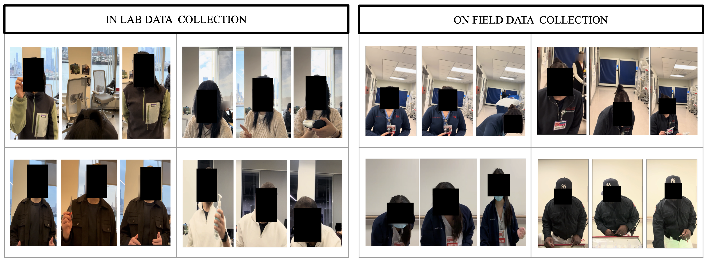
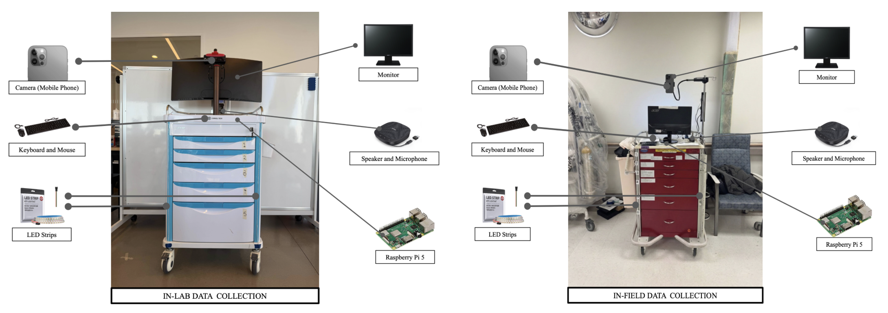
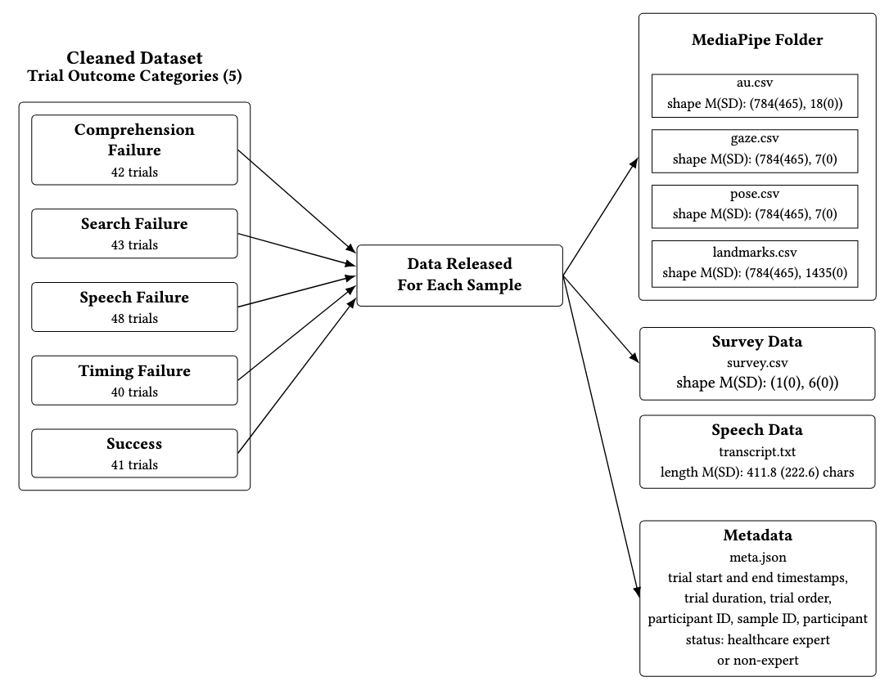

# RFM-HRI: Robot Failures in Medical Human-Robot Interaction Dataset

  
*Data collection environment at university laboratory (left) and hospital (right). Participant faces are anonymized in compliance with IRB protocol.*

  
*Robotic crash cart platforms in real-world hospital deployment (left) and controlled university campus laboratory evaluation (right).*

---

## Overview

RFM-HRI is a multimodal dataset capturing human responses to robot failures in healthcare-oriented item retrieval tasks. While robots inevitably encounter interaction failures in real-world deployments, understanding how humans react—both verbally and non-verbally—remains under-explored, especially in safety-critical environments like healthcare.

This dataset focuses on dyadic interactions with robots embodied as crash carts, where failures were systematically induced in four categories:  

1. **Speech Failures** – Robot produces inappropriate, incomplete, or confusing speech.  
2. **Timing Failures** – Robot delays actions or responses beyond expected timing.  
3. **Comprehension Failures** – Robot misinterprets user commands or queries.  
4. **Search Failures** – Robot fails to locate requested items or objects.

The dataset was collected through Wizard-of-Oz studies involving **41 participants** across laboratory and hospital settings, resulting in **214 interaction samples**.

---

## Dataset Contents

Each interaction sample includes:

- **Facial Action Units (AU)** – Capturing emotional expressions over time.  
- **Head Pose Data** – 3D orientation of the participant’s head.  
- **Speech Transcriptions** – Verbal responses of participants.  
- **Post-Interaction Self-Reports** – Emotional reactions (e.g., confusion, frustration, relief) and recovery strategy preferences.  

This multimodal representation enables analysis of human affect, control perception, and recovery strategy preferences in response to robot failures.

  
*The cleaned dataset is organized into five trial outcome categories (four injected robot failure types and success). For each trial, we release a self-contained sample comprising time-indexed visual behavioral features (MediaPipe-derived facial action units, gaze, pose, and landmarks), structured post-trial survey responses, and a natural-language task transcript. An overview of the dataset structure and accessible modalities is illustrated above. Together,
these views summarize both the dataset-level structure and the multimodal signals available for modeling trial outcomes and recovery preferences, while abstracting away file-level organization*

---

## Key Findings from Dataset Analysis

- Robot failures tend to **negatively affect user emotions** and reduce the sense of control.  
- Common emotional responses to failures include **confusion, annoyance, and frustration**, while successful interactions are generally associated with **positive emotions such as relief and confidence**.  
- Users show a **preference for verbal recovery strategies**, with multimodal and nonverbal strategies less frequently selected.  
- Emotional responses evolve over repeated failures, indicating that users adapt to robot behavior over time.

### Failure Types and Labels
Failure Type -> Robot Speech
- Speech Failure -> “Open the drawer”
- Timing Failure -> “Sorry, I am delayed…”
- Search Failure -> “I think the item is in drawer ___”
- Comprehension Failure -> “I did not understand that request.”

These insights provide a foundation for designing failure detection and recovery mechanisms in embodied HRI, both in healthcare and other structured item retrieval tasks.

---

## Dataset Usage

RFM-HRI can be used for:

- **Human-Robot Interaction Research** – Analyzing verbal and non-verbal responses to robot failures.  
- **Failure Detection Models** – Developing affect-aware HRI systems using facial, head pose, and speech data.  
- **Recovery Strategy Evaluation** – Designing robot recovery behaviors in safety-critical environments.  
- **Multimodal Machine Learning** – Exploring fusion of visual, auditory, and textual data for human behavioral modeling.

---

## Acknowledgement
This work was supported by the National Science Foundation under Grant No. IIS-2423127.
We thank all participants who contributed to this dataset and the hospital partners who facilitated data collection.

  
